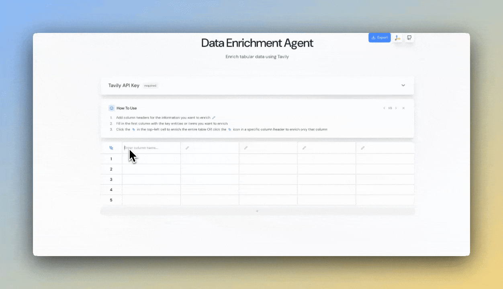
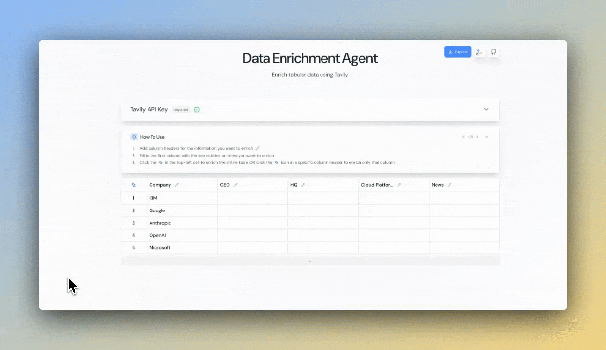

## 🚀 Welcome to the Spreadsheet Enrichment Repository!
This repository provides a powerful solution for building AI-enriched spreadsheets with real-time web access. The application combines [tavily's](https://tavily.com/) advanced search capabilities with to transform your business spreadsheets with intelligent web-sourced information.


### Step 1: Fill in spreadsheet columns
<div align="center">
  
</div>

### Step 2: Enrich your spreadsheet
<div align="center">
  
</div>

### Step 3: Export as CSV
<div align="center">
  
</div>

## Features

With this application, you can:
- 📊 Enrich spreadsheet cells with AI-generated content backed by live web data
- 🧠 Entity extraction and unstrcutured data processing with LLMs
- 🔄 Process entire columns as a batch for efficient data enhancement
- 📑 Source citations for all web-sourced information
- 📂 Export your enriched data as CSV files for further use

Designed for ease of customization, you can extend this core implementation to:
- Integrate proprietary data sources (e.g., vectorDB, GraphDB)
- Modify the LangGraph agent architecture
- Configure different LLMs
- Perform [time-range](https://docs.tavily.com/documentation/api-reference/endpoint/search#body-time-range) or [domain-filtered]((https://docs.tavily.com/documentation/api-reference/endpoint/search#body-include-domains)) web search using tavily's advanced search parameters
- Perform `news` or `finance` specialty search through tavily's [`topic` parameter](https://docs.tavily.com/documentation/api-reference/endpoint/search#topic))


<!-- ## Architecture Diagram
 -->

## Setup Instructions

#### API Keys:

This application requires API keys from the following services:
- [tavily API](https://app.tavily.com/home) (default) or Gemini optionally
- [OpenAI](https://platform.openai.com/docs/overview)
#### Set up environment variables:

   a. Create a `.env` file in the project's root directory with your API keys:
   ```bash
   TAVILY_API_KEY=<your API key>
   OPENAI_API_KEY=<your API key>
   GEMINI_API_KEY=<your API key>
   VITE_WS_URL=ws://localhost:8000
   VITE_APP_URL=http://localhost:5173

   ```

   b. Create a `.env.development` file in the `ui` directory with:
   ```bash
   VITE_API_URL=http://localhost:8000
   VITE_WS_URL=ws://localhost:8000
   ```

### Backend Setup
#### Python Virtual Environment
1. Create a virtual environment and activate it:
```bash
python3.11 -m venv venv
source venv/bin/activate  # On Windows: .\venv\Scripts\activate
```

2. Install dependencies:
```bash
python3.11 -m pip install -r requirements.txt
```

3. From the root of the project, run the backend server:
```bash
python app.py
```
#### Docker 

1. Alternatively, build and run the backend using Docker from the root of the project:
```bash
# Build the Docker image
docker build -t spreadsheet .

# Run the container
docker run -p 8000:8000 --env-file .env spreadsheet
```


### Frontend Setup

1. Navigate to the frontend directory:
```bash
cd ui
```

2. Install dependencies:
```bash
npm install
```

3. Start the development server:
```bash
npm run dev
```
4. Launch the app by pasting http://localhost:5173/ in your browser

## 📂 Repository Structure

This repository includes everything required to create a functional AI-powered spreadsheet with web access:

### Backend ([`backend/`](./backend))
The core backend logic, powered by tavily, watsonx.ai, and LangGraph:
- [`graph.py`](./backend/graph.py) – Defines the agent architecture, state management, and processing nodes.

### Frontend ([`ui/`](./ui))
Interactive React frontend for dynamic user interactions and spreadsheet responses.

### Server
- [`app.py`](./app.py) – FastAPI server that handles API endpoint.

---

## Contributing

Feel free to submit issues, PRs, and enhancement requests!

## 📞 Contact Us

Have questions, feedback, or looking to build a custom solution? We'd love to hear from you!

- Email our team directly:
  - [Dean Sacoransky](mailto:deansa@tavily.com)
  - [Michael Griff](mailto:michaelgriff@tavily.com)

---

<div align="center">
  
  <p>Powered by <a href="https://tavily.com">tavily</a></p>
</div>